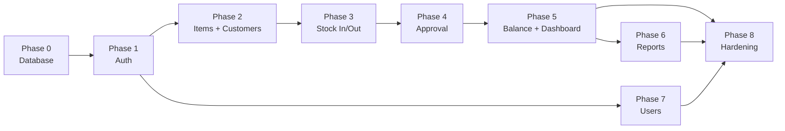

# Development Roadmap — Stock Management System

| Document | Value |
|----------|-------|
| **Project** | YUKIOH MYANMAR CO.,LTD — Stock Management |
| **Stack** | PHP 8.x, MySQL, HTML, Bootstrap 5, jQuery |
| **Current state** | UI/UX complete (mock data), directory structure ready |
| **Goal** | Fully dynamic application connected to MySQL backend |
| **Reference** | `docs/PRODUCT_SPEC.md`, `docs/module.txt` |

---

## 1. Current State (Baseline)

### Done
- [x] Product specification (`PRODUCT_SPEC.md`)
- [x] Project directory structure (MVC-style)
- [x] Responsive UI for all screens (Login, Dashboard, Items, Customers, Stock In/Out, Balance, Reports, Users)
- [x] MySQL schema, seeds, and PDO database layer
- [x] Real authentication, session timeout, CSRF protection
- [x] CRUD for all modules + approval workflow
- [x] Live balance, dashboard, and reports
- [x] User management (admin only)
- [x] Error logging (`storage/logs/app.log`)
- [x] Mock data and demo mode removed

### Optional / future
- [ ] Email notifications, expiry warnings (see `PRODUCT_SPEC.md`)
- [ ] REST API for mobile

---

## 2. Architecture (Target)

```
Browser
   ↓
public/pages/*.php          ← Entry point (route + auth check)
   ↓
app/controllers/*.php       ← Handle request, call services/models
   ↓
app/services/*.php          ← Business rules (approval, balance)
   ↓
app/models/*.php            ← PDO queries
   ↓
MySQL (stock_manage)
```

### Principles for development
1. **Keep existing UI views** — wire controllers to pass real data into current templates.
2. **One phase at a time** — finish and test each phase before moving on.
3. **Replace mock data incrementally** — remove `mock-data.php` usage per module when done.
4. **Server-side validation always** — never trust form input alone.
5. **Role checks on every write action** — admin vs staff per `PRODUCT_SPEC.md`.

---

## 3. Phase Overview

| Phase | Name | Outcome | Depends on |
|-------|------|---------|------------|
| **0** | Environment & Database | DB ready, tables created, seed admin | — |
| **1** | Auth & Session | Real login/logout, role-based access | Phase 0 |
| **2** | Master Data | Items + Customers CRUD | Phase 1 |
| **3** | Stock Transactions | Stock In + Stock Out CRUD | Phase 2 |
| **4** | Approval Workflow | Pending / Approve / Reject | Phase 3 |
| **5** | Balance & Dashboard | Live balance, charts, dashboard stats | Phase 4 |
| **6** | Reports | Filtered reports from DB | Phase 5 |
| **7** | User Management | Admin manages users | Phase 1 |
| **8** | Hardening & Cleanup | Security, polish, remove demo mode | All above |



> **Suggested build order:** 0 → 1 → 2 → 3 → 4 → 5 → 6 → 7 → 8  
> Phase 7 (Users) can run in parallel after Phase 1 if preferred.

---

## 4. Phase 0 — Environment & Database

**Goal:** MySQL database exists with full schema and seed data.

### Tasks
| # | Task | File(s) |
|---|------|---------|
| 0.1 | Create database `stock_manage` | `database/schema.sql` |
| 0.2 | Define `users` table | `database/schema.sql` |
| 0.3 | Define `items` table | `database/schema.sql` |
| 0.4 | Define `customers` table | `database/schema.sql` |
| 0.5 | Define `stock_in` table | `database/schema.sql` |
| 0.6 | Define `stock_out` table | `database/schema.sql` |
| 0.7 | Add indexes (status, dates, foreign keys) | `database/schema.sql` |
| 0.8 | Seed default admin user | `database/seeds.sql` |
| 0.9 | Verify `app/config/database.php` credentials | XAMPP local |
| 0.10 | Test PDO connection | `app/helpers/Database.php` |

### Database tables (MVP)

**users**
```
id, username, password_hash, display_name, role (admin|staff),
status (active|inactive), created_at, updated_at
```

**items**
```
id, item_no (unique), item_name, unit, unit_price, category,
remark, is_active, created_by, created_at, updated_at
```

**customers**
```
id, customer_code (unique), customer_name, address,
customer_type (Retail|Whole Sale), is_active,
created_by, created_at, updated_at
```

**stock_in**
```
id, item_id, mfd_date, expire_date, lot_no, qty, unit,
worker_qty, in_charge_name, status, rejection_reason,
created_by, approved_by, approved_at, created_at, updated_at
```

**stock_out**
```
id, item_id, customer_id, mfd_date, qty, unit, reason, remark,
status, rejection_reason, created_by, approved_by, approved_at,
created_at, updated_at
```

### Deliverables
- Working `schema.sql` + `seeds.sql`
- Default admin: `admin` / password set in seed (documented)
- Connection test passes

### Acceptance criteria
- [ ] `mysql -u root stock_manage` shows 5 tables
- [ ] Foreign keys enforce item/customer references
- [ ] Admin user can be selected from DB via PDO

---

## 5. Phase 1 — Authentication & Session

**Goal:** Replace demo login with real auth. Protect all pages.

### Tasks
| # | Task | File(s) |
|---|------|---------|
| 1.1 | Implement `User` model — `findByUsername`, `verifyPassword` | `app/models/User.php` |
| 1.2 | Implement `AuthController` — login, logout | `app/controllers/AuthController.php` |
| 1.3 | Wire `public/login.php` to AuthController | `public/login.php` |
| 1.4 | Wire `public/logout.php` — destroy session | `public/logout.php` |
| 1.5 | Remove `UI_DEMO_MODE` auto-login from bootstrap | `bootstrap/init.php` |
| 1.6 | Set `UI_DEMO_MODE = false` | `app/config/app.php` |
| 1.7 | Add flash messages (success/error) | `app/helpers/session.php`, partial |
| 1.8 | Redirect unauthorized users to login | All `public/pages/*.php` |
| 1.9 | Block inactive users from login | `AuthController` |

### Deliverables
- Login works with DB credentials
- Session stores `user_id`, `user` (id, username, display_name, role)
- Logout clears session
- Staff cannot access admin-only pages

### Acceptance criteria
- [ ] Wrong password shows generic error
- [ ] Admin login → full menu
- [ ] Staff login → no Users menu, no master Add/Edit
- [ ] Direct URL access without login redirects to `login.php`
- [ ] Inactive user cannot log in

---

## 6. Phase 2 — Master Data (Items & Customers)

**Goal:** Items and Customers modules read/write from MySQL.

### Tasks — Items
| # | Task | File(s) |
|---|------|---------|
| 2.1 | `Item` model — CRUD, search, unique check | `app/models/Item.php` |
| 2.2 | `ItemController` — index, create, store, edit, update, destroy | `app/controllers/ItemController.php` |
| 2.3 | Wire `public/pages/items/*.php` to controller | `public/pages/items/` |
| 2.4 | Server validation (required fields, unique item_no) | `ItemController` |
| 2.5 | Admin-only write; staff read-only list | Role check |
| 2.6 | Block delete if referenced in stock_in/stock_out | `ItemController` |
| 2.7 | Replace mock data in items views | Remove `mock_items()` |

### Tasks — Customers
| # | Task | File(s) |
|---|------|---------|
| 2.8 | `Customer` model — CRUD, search | `app/models/Customer.php` |
| 2.9 | `CustomerController` — full CRUD | `app/controllers/CustomerController.php` |
| 2.10 | Wire `public/pages/customers/*.php` | `public/pages/customers/` |
| 2.11 | Block delete if referenced in stock_out | `CustomerController` |
| 2.12 | Replace mock data in customer views | Remove `mock_customers()` |

### Deliverables
- Items: Search, Add, Edit, Delete (admin), List (all roles)
- Customers: same pattern
- Filters on list pages query database

### Acceptance criteria
- [ ] Add item → appears in list
- [ ] Duplicate item_no rejected
- [ ] Edit updates record
- [ ] Delete blocked when stock records exist
- [ ] Staff sees list but no Add/Edit/Delete buttons
- [ ] Search/filter returns correct results

---

## 7. Phase 3 — Stock In & Stock Out (CRUD)

**Goal:** Record stock transactions in database (status logic in Phase 4).

### Tasks — Stock In
| # | Task | File(s) |
|---|------|---------|
| 3.1 | `StockIn` model — CRUD, list with filters | `app/models/StockIn.php` |
| 3.2 | `StockInController` — index, create, store, edit, update, destroy | `app/controllers/StockInController.php` |
| 3.3 | Wire `public/pages/stock-in/*.php` | `public/pages/stock-in/` |
| 3.4 | Item dropdown from DB; auto-fill unit/name | Form + JS |
| 3.5 | Default `in_charge_name` from logged-in user | Controller |
| 3.6 | Set initial status: admin=`approved`, staff=`pending` | Controller |
| 3.7 | Staff can edit/delete only own pending records | Controller |

### Tasks — Stock Out
| # | Task | File(s) |
|---|------|---------|
| 3.8 | `StockOut` model — CRUD, list with filters | `app/models/StockOut.php` |
| 3.9 | `StockOutController` — full CRUD | `app/controllers/StockOutController.php` |
| 3.10 | Wire `public/pages/stock-out/*.php` | `public/pages/stock-out/` |
| 3.11 | Customer dropdown from DB | Form |
| 3.12 | Show item balance in dropdown (read from balance query) | Form |
| 3.13 | Same status rules as Stock In | Controller |

### Deliverables
- Stock In/Out forms save to database
- List pages show records with correct status badges
- Filters: date, status, item, customer (out), reason (out)

### Acceptance criteria
- [x] Admin creates Stock In → status `approved` immediately
- [x] Staff creates Stock In → status `pending`
- [x] List filters work from database
- [x] Edit/delete only allowed on pending (staff: own only)
- [x] Approved records cannot be edited/deleted

---

## 8. Phase 4 — Approval Workflow

**Goal:** Admin approves/rejects staff requests. Business rules enforced.

### Tasks
| # | Task | File(s) |
|---|------|---------|
| 4.1 | `ApprovalService` — approve, reject | `app/services/ApprovalService.php` |
| 4.2 | Approve Stock In — set status, approved_by, approved_at | Service |
| 4.3 | Approve Stock Out — same + balance validation | Service |
| 4.4 | Reject — require reason, store rejection_reason | Service |
| 4.5 | API/action endpoints for approve/reject buttons | `public/pages/stock-in/`, `stock-out/` or `public/api/` |
| 4.6 | Wire approval modal in UI to backend | `app.js` + controller |
| 4.7 | Prevent staff from approving own requests | Role check |
| 4.8 | Stock Out: block approval if qty > balance | `ApprovalService` + `BalanceService` |

### Deliverables
- Approve/Reject buttons work on Stock In and Stock Out lists
- Rejection reason saved and visible
- Insufficient stock blocks Stock Out approval

### Acceptance criteria
- [x] Approve pending Stock In → status `approved`, audit fields set
- [x] Reject → status `rejected`, reason required
- [x] Stock Out approval fails when balance insufficient
- [x] Only admin can approve/reject
- [x] Pending count on topbar reflects DB count

---

## 9. Phase 5 — Balance & Dashboard

**Goal:** Computed balance and dashboard from live data.

### Tasks
| # | Task | File(s) |
|---|------|---------|
| 5.1 | `BalanceService` — getItemBalance, getAllBalances, categoryTotals | `app/services/BalanceService.php` |
| 5.2 | `Balance` model — SQL aggregation queries | `app/models/Balance.php` |
| 5.3 | `BalanceController` — index with filters | `app/controllers/BalanceController.php` |
| 5.4 | Wire `public/pages/balance/index.php` | Balance page |
| 5.5 | Chart data from real category totals | View + Chart.js |
| 5.6 | `DashboardController` — stats, pending, activity | `app/controllers/DashboardController.php` |
| 5.7 | Wire `public/pages/dashboard.php` | Dashboard |
| 5.8 | Admin pending list from DB; staff sees own only | Dashboard |
| 5.9 | Recent activity from approved in/out (latest 10) | Dashboard |
| 5.10 | Remove all `mock_dashboard_*` usage | `mock-data.php` |

### Balance SQL (reference)
```sql
balance(item) = SUM(stock_in.qty WHERE approved) - SUM(stock_out.qty WHERE approved)
```

### Deliverables
- Balance list with correct quantities
- Dashboard stat cards from DB
- Charts reflect real data

### Acceptance criteria
- [x] Balance updates after approved Stock In
- [x] Balance decreases after approved Stock Out
- [x] Pending records do NOT affect balance
- [x] Dashboard pending count matches DB
- [x] Low-stock items highlighted correctly

---

## 10. Phase 6 — Reports

**Goal:** Reports page generates output from filtered DB queries.

### Tasks
| # | Task | File(s) |
|---|------|---------|
| 6.1 | `ReportController` — index, generate by type | `app/controllers/ReportController.php` |
| 6.2 | Report: Stock In (filtered) | Controller + model |
| 6.3 | Report: Stock Out (filtered) | Controller + model |
| 6.4 | Report: Current Stock snapshot | Reuse BalanceService |
| 6.5 | Report: Activity summary | Controller |
| 6.6 | Wire filter form to controller (GET params) | `public/pages/reports/index.php` |
| 6.7 | Print view with company header | Existing report template |
| 6.8 | Pagination for large result sets | Controller |

### Deliverables
- All report types from `PRODUCT_SPEC.md` section 7
- Filters: date, category, item, customer, reason, status, type

### Acceptance criteria
- [x] Each report type returns correct data
- [x] Filters combine correctly (AND logic)
- [x] Print layout shows company name and ID
- [x] Empty result shows friendly message

---

## 11. Phase 7 — User Management

**Goal:** Admin creates and manages staff accounts.

### Tasks
| # | Task | File(s) |
|---|------|---------|
| 7.1 | `User` model — CRUD (extend from Phase 1) | `app/models/User.php` |
| 7.2 | `UserController` — index, create, store, edit, update, deactivate | `app/controllers/UserController.php` |
| 7.3 | Wire `public/pages/users/*.php` | `public/pages/users/` |
| 7.4 | Password hash on create/update | Controller |
| 7.5 | Prevent deleting/deactivating self (admin id=1) | Controller |
| 7.6 | Replace mock users in views | Remove `mock_users()` |

### Deliverables
- Admin can add Staff-1, Staff-2, etc.
- Edit role, status, display name
- Deactivate user blocks login

### Acceptance criteria
- [x] Create staff user → can log in
- [x] Deactivate user → login fails
- [x] Username unique enforced
- [x] Password min 8 chars enforced
- [x] Only admin accesses Users module

---

## 12. Phase 8 — Hardening & Cleanup

**Goal:** Production-ready security and code cleanup.

### Tasks
| # | Task | File(s) |
|---|------|---------|
| 8.1 | CSRF tokens on all POST forms | Helper + all forms |
| 8.2 | Prepared statements only (audit all models) | `app/models/` |
| 8.3 | Central error handling / logging | `storage/logs/` |
| 8.4 | Input sanitization review | Controllers |
| 8.5 | Session timeout (30 min) enforcement | `session.php` |
| 8.6 | Delete `app/helpers/mock-data.php` | Cleanup |
| 8.7 | Remove `UI_DEMO_MODE` constant entirely | `app/config/app.php` |
| 8.8 | Remove TODO stubs; finalize controllers | All |
| 8.9 | Manual test against acceptance criteria in PRODUCT_SPEC §14 | QA |
| 8.10 | Optional: README setup instructions | `README.md` (if requested) |

### Deliverables
- No mock data remaining
- Security checklist passed
- All PRODUCT_SPEC MVP acceptance criteria met

### Acceptance criteria
- [x] All 9 MVP acceptance criteria from `PRODUCT_SPEC.md` pass
- [x] No hardcoded demo users/passwords
- [x] CSRF validated on forms
- [x] Mobile UI still works end-to-end

---

## 13. File Change Map (Per Phase)

| Phase | Primary files to implement |
|-------|---------------------------|
| 0 | `database/schema.sql`, `database/seeds.sql` |
| 1 | `User.php`, `AuthController.php`, `login.php`, `logout.php`, `bootstrap/init.php` |
| 2 | `Item.php`, `Customer.php`, `ItemController.php`, `CustomerController.php`, `pages/items/*`, `pages/customers/*` |
| 3 | `StockIn.php`, `StockOut.php`, controllers, `pages/stock-in/*`, `pages/stock-out/*` |
| 4 | `ApprovalService.php`, approve/reject actions, `app.js` |
| 5 | `BalanceService.php`, `Balance.php`, `DashboardController.php`, `pages/dashboard.php`, `pages/balance/*` |
| 6 | `ReportController.php`, `pages/reports/index.php` |
| 7 | `UserController.php`, `pages/users/*` |
| 8 | Global helpers, cleanup, security |

---

## 14. Testing Checklist (Per Phase)

Use this quick test flow after each phase:

| Phase | Smoke test |
|-------|------------|
| 0 | Import SQL, query tables in phpMyAdmin |
| 1 | Login as admin + staff, test logout |
| 2 | CRUD one item and one customer |
| 3 | Create stock in (admin) and stock out (staff pending) |
| 4 | Approve and reject a pending record |
| 5 | Verify balance on Balance page matches manual calculation |
| 6 | Run each report type with one filter |
| 7 | Create staff user, login as new staff |
| 8 | Full walkthrough all modules on mobile + desktop |

---

## 15. Out of Scope (Post-MVP / Phase 9+)

Defer until MVP roadmap is complete:

| Feature | Notes |
|---------|-------|
| Excel/PDF export | Phase 9 |
| Email notifications | Phase 9 |
| Expiry date alerts | Phase 9 |
| Lot-level balance | Phase 9 |
| Void/correction entries | Phase 9 |
| API for mobile app | Phase 10 |

---

## 16. Development Rules (Team Agreement)

1. **Follow phase order** — do not skip to Reports before Stock In/Out works.
2. **One module fully done** before starting the next in the same phase.
3. **Keep UI unchanged** unless a bug fix — backend only unless UX issue found.
4. **Commit per phase** (when using git) — e.g. `feat(phase-2): items and customers CRUD`.
5. **Update this roadmap** — check off tasks as completed.
6. **Reference PRODUCT_SPEC** for any field/rule dispute.

---

## 17. Progress Tracker

| Phase | Status | Completed date |
|-------|--------|----------------|
| 0 — Database | ✅ Complete | 2026-06-05 |
| 1 — Auth | ✅ Complete | 2026-06-05 |
| 2 — Items & Customers | ✅ Complete | 2026-06-05 |
| 3 — Stock In/Out | ✅ Complete | 2026-06-05 |
| 4 — Approval | ✅ Complete | 2026-06-05 |
| 5 — Balance & Dashboard | ✅ Complete | 2026-06-05 |
| 6 — Reports | ✅ Complete | 2026-06-05 |
| 7 — Users | ✅ Complete | 2026-06-05 |
| 8 — Hardening | ✅ Complete | 2026-06-05 |

---

## 18. Next Step

**All MVP phases (0–8) are complete.**

The application is production-ready for deployment on XAMPP. Optional next steps: email notifications, expiry warnings, REST API (see `PRODUCT_SPEC.md` future enhancements).

---

*End of roadmap*
